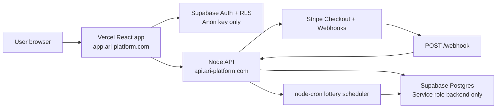

# ARI Lottery Production Deployment Guide

This guide deploys ARI Lottery as a production SaaS platform:

- Frontend: Vercel at `https://app.ari-platform.com`
- Backend API: Render or Railway at `https://api.ari-platform.com`
- Database/Auth: Supabase
- Payments/Webhooks: Stripe

## Architecture



## 1. Pre-Deployment Checks

Run locally:

```bash
npm install
npm run build
npm audit --omit=dev
```

Run [supabase/schema.sql](C:/Users/dell/OneDrive/Documents/ari-lottery/supabase/schema.sql) in the Supabase SQL editor before enabling production payments.

## 2. Production Environment Variables

Use [.env.production.example](C:/Users/dell/OneDrive/Documents/ari-lottery/.env.production.example) as the source of truth.

### Vercel Frontend

Set these in Vercel Project Settings > Environment Variables:

```bash
VITE_SUPABASE_URL=https://your-project.supabase.co
VITE_SUPABASE_ANON_KEY=your_supabase_anon_key
VITE_STRIPE_PUBLISHABLE_KEY=pk_live_...
VITE_API_BASE_URL=https://api.ari-platform.com
```

Never add `STRIPE_SECRET_KEY` or `SUPABASE_SERVICE_ROLE_KEY` to Vercel frontend env.

### Backend

Set these in Render or Railway:

```bash
NODE_ENV=production
STRIPE_SECRET_KEY=sk_live_...
STRIPE_WEBHOOK_SECRET=whsec_...
SUPABASE_URL=https://your-project.supabase.co
SUPABASE_SERVICE_ROLE_KEY=your_service_role_key
CRON_SCHEDULE="0 0 */3 * *"
ADMIN_API_KEY=long_random_secret
CLIENT_URL=https://app.ari-platform.com
CLIENT_URLS=https://app.ari-platform.com
DISABLE_LOTTERY_CRON=false
```

## 3. Deploy Frontend To Vercel

1. Push the repo to GitHub.
2. Import the repo in Vercel.
3. Keep framework preset as Vite.
4. Build command: `npm run build`.
5. Output directory: `dist`.
6. Add the frontend env variables above.
7. Add custom domain: `app.ari-platform.com`.
8. Confirm SPA routing works:
   - `/auth`
   - `/dashboard`
   - `/buy`
   - `/tokens`
   - `/transactions`
   - `/profile`

The included [vercel.json](C:/Users/dell/OneDrive/Documents/ari-lottery/vercel.json) rewrites all frontend routes to `index.html`.

## 4. Deploy Backend To Render

Option A: Blueprint deploy with [render.yaml](C:/Users/dell/OneDrive/Documents/ari-lottery/render.yaml).

Option B: Manual Render web service:

1. Create a new Web Service from GitHub.
2. Runtime: Node.
3. Build command: `npm install`.
4. Start command: `npm run server`.
5. Health check path: `/health`.
6. Add backend env variables.
7. Add custom domain: `api.ari-platform.com`.

Important: run only one scheduler-enabled backend instance unless you move lottery scheduling to an external job runner. For multi-instance API scaling, set `DISABLE_LOTTERY_CRON=true` on web instances and run one dedicated worker with cron enabled.

## 5. Deploy Backend To Railway

The included [railway.json](C:/Users/dell/OneDrive/Documents/ari-lottery/railway.json) uses:

- Start command: `npm run server`
- Health path: `/health`

Add the same backend env variables in Railway Variables, then attach the production domain `api.ari-platform.com`.

## 6. Stripe Live Mode Checklist

In Stripe Live Mode:

1. Create or reveal live API keys.
2. Put `pk_live_...` in Vercel as `VITE_STRIPE_PUBLISHABLE_KEY`.
3. Put `sk_live_...` in backend hosting as `STRIPE_SECRET_KEY`.
4. Create a webhook endpoint:

   ```text
   https://api.ari-platform.com/webhook
   ```

5. Subscribe to:

   ```text
   checkout.session.completed
   ```

6. Copy the live webhook signing secret into backend env:

   ```bash
   STRIPE_WEBHOOK_SECRET=whsec_...
   ```

7. Confirm Checkout redirects:
   - Success: `https://app.ari-platform.com/dashboard`
   - Cancel: `https://app.ari-platform.com/buy`

The backend derives these URLs from `CLIENT_URL`.

## 7. Supabase Production Checklist

Confirm:

- `transactions`, `lottery_tokens`, `lottery_draws`, and `winners` exist.
- RLS is enabled on all user-facing tables.
- Authenticated users can select only their own transactions, tokens, and winner records.
- Draw records are readable according to your product policy.
- Service role key is only present in backend hosting.
- Frontend uses only `VITE_SUPABASE_ANON_KEY`.
- Realtime is enabled for tables used by the dashboard.

## 8. Domain And CORS

Production domains:

```bash
Frontend: https://app.ari-platform.com
Backend:  https://api.ari-platform.com
```

Backend CORS allows origins from `CLIENT_URLS`. For one frontend:

```bash
CLIENT_URLS=https://app.ari-platform.com
```

For previews or staging:

```bash
CLIENT_URLS=https://app.ari-platform.com,https://staging.ari-platform.com
```

## 9. Final Health Check

After deploying backend, open:

```text
https://api.ari-platform.com/health
```

Expected production response:

```json
{
  "stripeConfigured": true,
  "webhookConfigured": true,
  "supabaseConfigured": true,
  "lotterySchedulerConfigured": true,
  "environment": "production"
}
```

Then verify:

1. Register a new user.
2. Buy one token.
3. Complete Stripe Checkout.
4. Confirm webhook inserts transaction and tokens.
5. Confirm dashboard token balance updates.
6. Run a manual draw:

   ```bash
   curl -X POST https://api.ari-platform.com/run-lottery \
     -H "x-admin-key: your_admin_api_key"
   ```

7. Confirm tokens become `used`, draw is recorded, and winner record is created.

## 10. Security Checklist

- Rotate any Stripe secret key that was pasted into chat or committed anywhere.
- Keep `.env` out of git.
- Use live Stripe keys only in production.
- Use Supabase service role only in backend hosting.
- Keep `ADMIN_API_KEY` long, random, and private.
- Keep webhook signature verification enabled.
- Keep backend rate limiting and Helmet enabled.
- Use HTTPS-only production domains.
- Run one scheduler-enabled instance, or move cron to a dedicated worker.
- Monitor backend logs for webhook failures and lottery draw errors.
